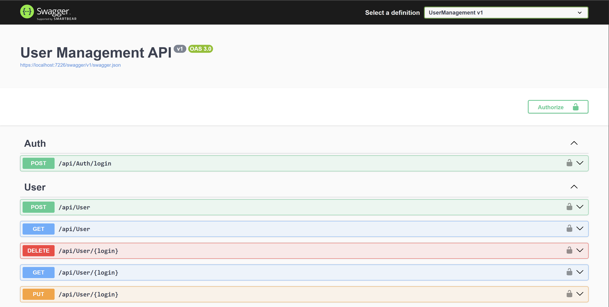
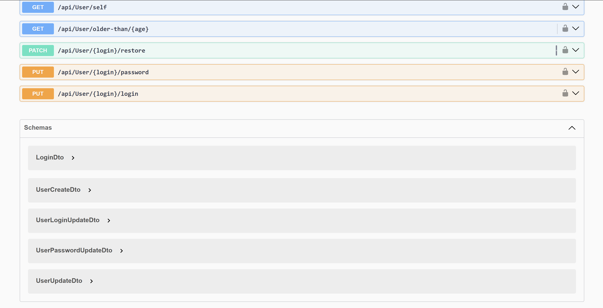
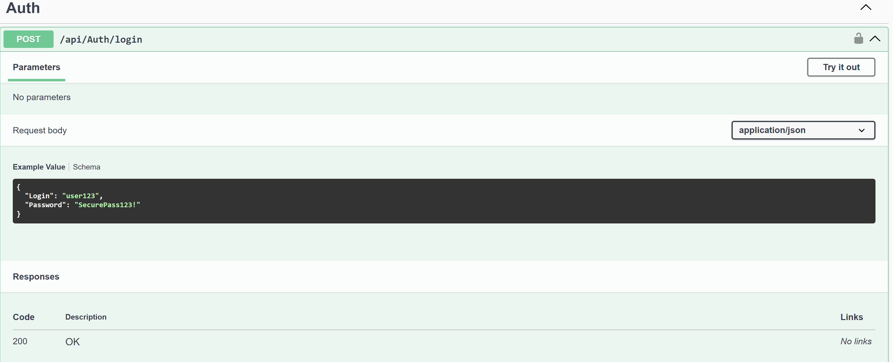
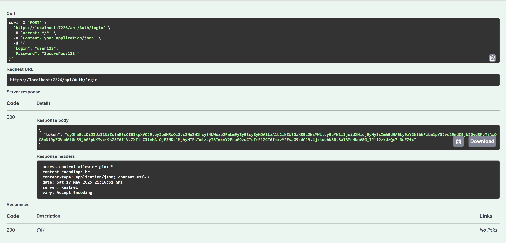
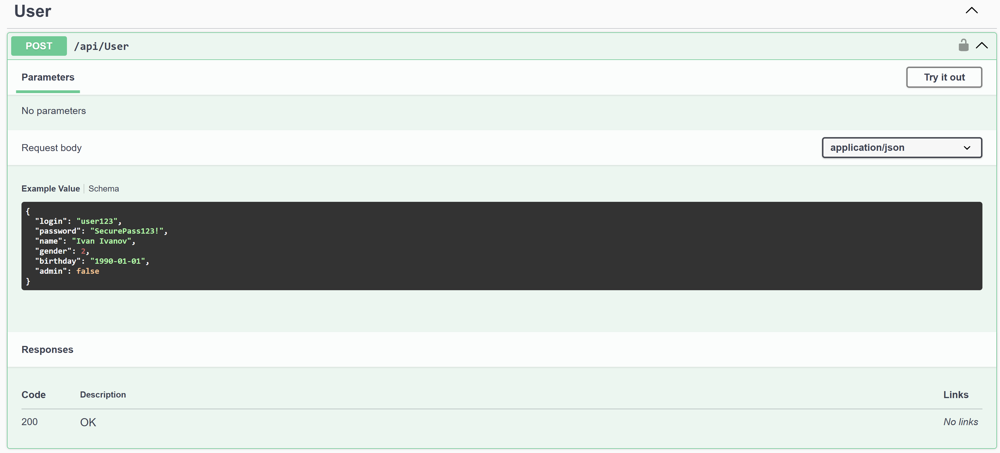
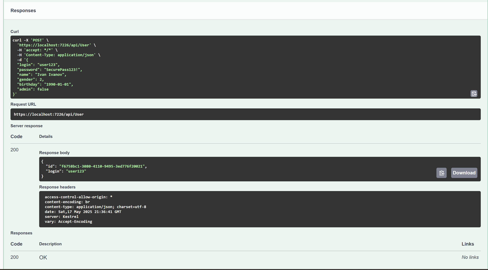

# User Management API


<table>
  <tr>
    <td></td>
    <td></td>
  </tr>
</table>

## 📝 Описание

Микросервис для управления пользователями с JWT-аутентификацией и ролевой моделью.  
**Основные возможности**:

- **JWT-аутентификация** с ролями (Admin/User)
- **Полный CRUD** для управления пользователями
- **Валидация** данных на всех уровнях
- **Кеширование** часто используемых запросов
- **Swagger UI** с авторизацией

Этот проект представляет собой сервис управления пользователями, построенный на современном стеке технологий .NET 9. В его основе лежит RESTful API, который обеспечивает безопасную аутентификацию через JWT-токены и гибкое управление учетными записями с разграничением прав доступа.

Система разработана с акцентом на безопасность и производительность. Вместо традиционной базы данных используется in-memory хранилище, что позволяет добиться минимальных задержек при обработке запросов. Аутентификация реализована через стандарт JWT Bearer, где каждый токен содержит информацию о роли пользователя (Admin или обычный User) и имеет ограниченное время жизни.

- **🔒Безопасность**
  - Пароли хранятся в хэшированном виде с использованием алгоритма PBKDF2-SHA-256 (100,000 итераций) и уникальной соли
  - Все запросы (кроме аутентификации и регистрации) требуют JWT-токен в заголовке Authorization
  - Реализовано комплексное логирование критических операций (аутентификация, изменения данных)
  
- **🧩Архитектура**:
  - Четкое разделение на модули (аутентификация, управление пользователями)
  - Сервисный слой (UserManager для CRUD-операций, JwtService для работы с токенами)
  - Строгая валидация входящих данных и единая система обработки ошибок
  - Поддержка пагинации и фильтрации (например, по возрасту)

- **🚀Производительность**
  - In-memory кэш для часто запрашиваемых данных (настройки JWT, списки пользователей)
  - Policy-based кэширование ответов API (особенно для GET /users и профилей)
  - Кэширование схем Swagger (во избежание повторной генерации примеров)

- **🎮Функционал**:
  - Полный набор операций с пользователями: регистрация, просмотр/редактирование профилей, мягкое удаление/восстановление аккаунтов
  - Администраторы имеют доступ ко всем учетным записям, обычные пользователи — только к своим
  - Гибкая архитектура, позволяющая легко расширять систему (добавление ролей, интеграция с БД)
  - Кастомный фильтр для Swagger, автоматически генерирующий примеры запросов для всех DTO:

**Незначительные изменения в условии задания**: в сущность user добавлено поле `IsActive`, которое позволяет удобно отслеживать - активен ли пользователь или нет, также `Password` заменено на `HashPassword`, так как я храню пароль в виде комбинации хэш + соль, для улучшения безопастности. **Дополнительно**, я добавил собственные валидации для логина, пароля, имени и даты рождения, чтобы данные были корректные и безопастные. Также было непонятно, метод `Create` доступен только администраторам или же он доступен обсулютно все пользователям, даже неавторизированным, но указание, будет ли пользователь администратором, доступно только Админам. Я реализовал второй вариант, так как мне он показался более логичным, но изменить, в случае моей неправоты - не составит труда.

**Основные API endpoints:**

- `POST /api/auth/login` - аутентификация пользователя и получение токена `[AllowAnonymous]`
- **`POST /api/users` - регистрация нового пользователя (без авторизации, но Admin'a может создать только Admin) `[AllowAnonymous]`**
- `GET /api/users/self` - получение информации о текущем пользователе `[Authorize]`
- `PUT /api/users/{login}` - обновление данных пользователя `[Authorize]`
- `PUT /api/users/{login}/password` - смена пароля `[Authorize]`
- `PUT /api/users/{login}/login` - изменение логина `[Authorize]`
- `GET /api/users` - получение списка пользователей `[Authorize(Roles = "Admin")]`
- `GET /api/users/{login}` - информация о конкретном пользователе `[Authorize(Roles = "Admin")]`
- `GET /api/users/older-than/{age}` - фильтрация пользователей по возрасту `[Authorize(Roles = "Admin")]`
- `DELETE /api/users/{login}` - удаление пользователя `[Authorize(Roles = "Admin")]`
- `PATCH /api/users/{login}/restore` - восстановление удаленного пользователя `[Authorize(Roles = "Admin")]`

## 🛠️ Технологический стек

| Компонент            | Версия   | Назначение                    |
|----------------------|----------|--------------------------------|
| .NET                 | 9.0      | Базовый фреймворк              |
| ASP.NET Core         | 9.0      | Веб-платформа                  |
| JWT Bearer           | 9.0.5    | Аутентификация                 |
| Swagger              | 8.1.1    | Документирование API           |
| NSwag                | 14.4.0   | Генерация клиентов             |
| MemoryCache          |          | Кеширование данных             |

## 🌿 Структура проекта

```plaintext
📂UserManagement/
├──📂Controllers/                  # Содержит контроллеры API (обработчики HTTP-запросов)
├──📂Exceptions/                   # Кастомные исключения приложения
├──📂Models/                       # Модели данных и DTO (Data Transfer Objects)
├──📂Services/                     # Бизнес-логика и сервисы приложения
├──📂Utilities/                    # Вспомогательные утилиты и хелперы
├──📄appsettings.Development.json  # Конфигурации для среды разработки
├──📄appsettings.json              # Основные конфигурации приложения
├──📄UserManagement.http           # Файл для тестирования API
└──📄Program.cs                    # Точка входа и конфигурация приложения
```

## 🎯 Примеры запросов

### **Аутентификация**

```http
POST /api/auth/login
Content-Type: application/json

{
  "login": "Admin",
  "password": "Admin_123"
}
```

**Ответ:**

```json
{
  "token": "eyJhbGciOiJIUzI1NiIs...",
  "expires": "2025-05-18T23:59:59"
}
```

**Отображение в Swagger:**

<div align="center">


*Фото 1: Авторизация в Swagger UI*


*Фото 2: Авторизация в Swagger UI*

</div>

### **Создание пользователя**

```http
POST /api/users
Authorization: Bearer <your_token>
Content-Type: application/json

{
  "login": "user123",
  "password": "SecurePass123!",
  "name": "Ivan Ivanov",
  "gender": 2,
  "birthday": "1990-01-01",
  "admin": false
}
```

**Отображение в Swagger:**

<div align="center">


*Фото 1: Создание пользователя в Swagger UI*


*Фото 2: Создание пользователя в Swagger UI*

</div>