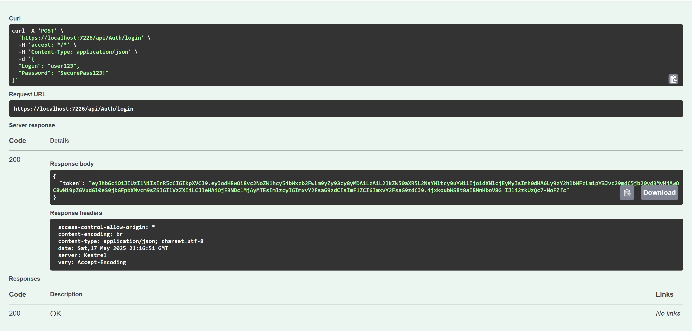

# User Management API

  


## 📝 Описание

Микросервис для управления пользователями с JWT-аутентификацией и ролевой моделью.  
**Основные возможности**:

- **JWT-аутентификация** с ролями (Admin/User)
- **Полный CRUD** для управления пользователями
- **Валидация** данных на всех уровнях
- **Кеширование** часто используемых запросов
- **Swagger UI** с авторизацией

## 🛠 Технологии

| Технология       | Назначение                          |
|------------------|-------------------------------------|
| .NET 9           | Бэкенд-фреймворк                    |
| JWT              | Аутентификация                      |
| Swagger          | Документирование API                |
| MemoryCache      | Кеширование данных                  |

### Структура проекта

```plaintext
📂UserManagement/
├──📂Controllers/                  # Содержит контроллеры API (обработчики HTTP-запросов)
├──📂Exceptions/                   # Кастомные исключения приложения
├──📂Models/                       # Модели данных и DTO (Data Transfer Objects)
├──📂Services/                     # Бизнес-логика и сервисы приложения
├──📂Utilities/                    # Вспомогательные утилиты и хелперы
├──📄appsettings.Development.json  # Конфигурации для среды разработки
├──📄appsettings.json              # Основные конфигурации приложения
├──📄UserManagement.http           # Файл для тестирования API
└──📄Program.cs                    # Точка входа и конфигурация приложения
```

## Примеры запросов

### **Аутентификация**

```http
POST /api/auth/login
Content-Type: application/json

{
  "login": "Admin",
  "password": "Admin_123"
}
```

**Ответ:**

```json
{
  "token": "eyJhbGciOiJIUzI1NiIs...",
  "expires": "2025-05-18T23:59:59"
}
```

**Отображение в Swagger:**

<div align="center">

  
  <p><em>Фото. 1: Авторизация в Swagger UI</em></p>

  
  <p><em>Фото. 2: Авторизация в Swagger UI</em></p>

</div>

### **Создание пользователя**

```http
POST /api/users
Authorization: Bearer <your_token>
Content-Type: application/json

{
  "login": "user123",
  "password": "SecurePass123!",
  "name": "Ivan Ivanov",
  "gender": 2,
  "birthday": "1990-01-01",
  "admin": false
}
```

**Отображение в Swagger:**

<div align="center">

  
  <p><em>Фото. 1: Создание пользователя в Swagger UI</em></p>

  
  <p><em>Фото. 2: Создание пользователя в Swagger UI</em></p>

</div>
